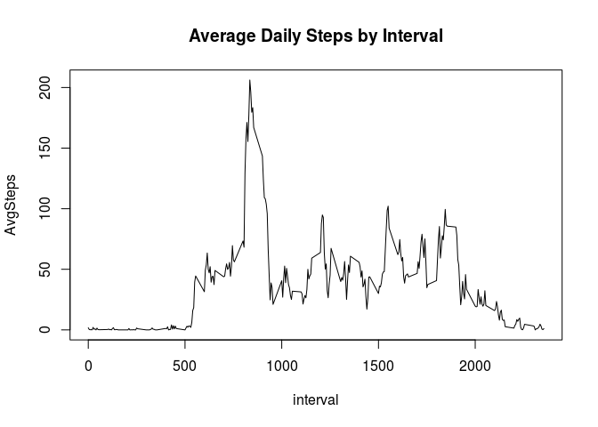
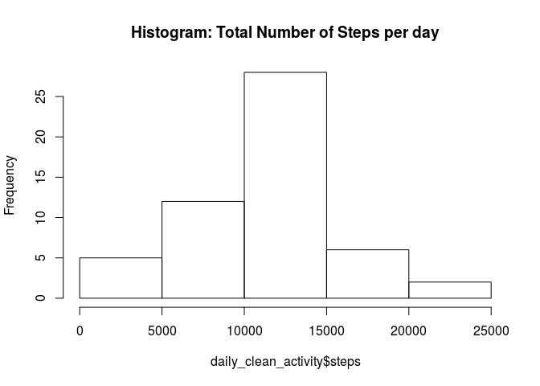
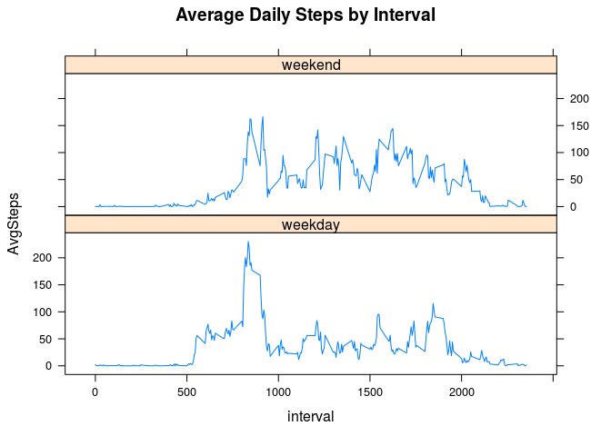

## Loading and preprocessing the data
- Load necessary packages
- if csv file does not exist unzip activity.zip

```r
suppressMessages(library(tidyverse))
library(lattice)
if(!file.exists("activity.csv")){unzip("activity.zip")}
activity = read.csv("activity.csv")
head(activity)
```

```
##   steps       date interval
## 1    NA 2012-10-01        0
## 2    NA 2012-10-01        5
## 3    NA 2012-10-01       10
## 4    NA 2012-10-01       15
## 5    NA 2012-10-01       20
## 6    NA 2012-10-01       25
```


## What is mean total number of steps taken per day?

```r
daily_activity = activity[!is.na(activity),] %>%
  group_by(date) %>%
  summarise(daily_steps=sum(steps))
```

```
## Warning: Factor `date` contains implicit NA, consider using
## `forcats::fct_explicit_na`
```
- Mean number of steps: 1.076619\times 10^{4}
- Median number of steps: 1.0765\times 10^{4}


```r
hist(daily_activity$daily_steps, main="Histogram: Total Number of Steps per day")
```

<!-- -->

```r
mean(daily_activity$daily_steps, na.rm=TRUE)
```

```
## [1] 10766.19
```

```r
median(daily_activity$daily_steps, na.rm=TRUE)
```

```
## [1] 10765
```

## What is the average daily activity pattern?

1. Make a time series plot (i.e. type = "l") of the 5-minute interval (x-axis) and the average number of steps taken, averaged across all days (y-axis)

```r
summary_activity = activity[!is.na(activity$steps), ] %>%
  group_by(interval) %>%
  summarise(AvgSteps = mean(steps))

max_step_interval <- summary_activity[summary_activity$AvgSteps == max(summary_activity$AvgSteps), "interval" ][[1]]

with(summary_activity, 
     plot(x= interval,
          y=AvgSteps,
          type="l",
          main="Average Daily Steps by Interval" )
)
```

<!-- -->

2. Which 5-minute interval, on average across all the days in the dataset, contains the maximum number of steps?


```r
max_step_interval
```

```
## [1] 835
```


## Imputing missing values
1. Calc number of NA's

```r
sum(is.na(activity$steps))
```

```
## [1] 2304
```

2. Fill NA's with mean from interval

```r
na_fill_mean = function(interval){
  result = seq_len(length(interval))
  for(i in 1:length(interval)){
    result[i] = mean(activity$steps[activity$interval==interval[i]], na.rm=TRUE)
      }
  return(as.vector(result))
}
```
3. Create copy of dataset replacing NAs

```r
clean_activity <- activity
clean_activity$steps[is.na(activity$steps)] = na_fill_mean(activity[is.na(activity),"interval"])
str(clean_activity)
```

```
## 'data.frame':	17568 obs. of  3 variables:
##  $ steps   : num  1.717 0.3396 0.1321 0.1509 0.0755 ...
##  $ date    : Factor w/ 61 levels "2012-10-01","2012-10-02",..: 1 1 1 1 1 1 1 1 1 1 ...
##  $ interval: int  0 5 10 15 20 25 30 35 40 45 ...
```

```r
str(activity)
```

```
## 'data.frame':	17568 obs. of  3 variables:
##  $ steps   : int  NA NA NA NA NA NA NA NA NA NA ...
##  $ date    : Factor w/ 61 levels "2012-10-01","2012-10-02",..: 1 1 1 1 1 1 1 1 1 1 ...
##  $ interval: int  0 5 10 15 20 25 30 35 40 45 ...
```
4. Historgram, mean and median of clean dataset

```r
daily_clean_activity = clean_activity[!is.na(activity),] %>%
  group_by(date) %>%
  summarise(steps=sum(steps))
```

```
## Warning: Factor `date` contains implicit NA, consider using
## `forcats::fct_explicit_na`
```


```r
hist(daily_clean_activity$steps, main="Histogram: Total Number of Steps per day")
```

<!-- -->

```r
mean(daily_clean_activity$steps, na.rm=TRUE)
```

```
## [1] 10766.19
```

```r
median(daily_clean_activity$steps, na.rm=TRUE)
```

```
## [1] 10765
```
- change in mean: 0
- change in median: 0

## Are there differences in activity patterns between weekdays and weekends?

1. Create factor variable for weekday vs weekend


```r
WEEKEND = c("Saturday", "Sunday")
clean_activity$weekend = weekdays(as.Date(clean_activity$date)) %in% WEEKEND
clean_activity$weekend[clean_activity$weekend==TRUE] = "weekend"
clean_activity$weekend[clean_activity$weekend==FALSE] = "weekday"
clean_activity$weekend = as.factor(clean_activity$weekend)
str(clean_activity)
```

```
## 'data.frame':	17568 obs. of  4 variables:
##  $ steps   : num  1.717 0.3396 0.1321 0.1509 0.0755 ...
##  $ date    : Factor w/ 61 levels "2012-10-01","2012-10-02",..: 1 1 1 1 1 1 1 1 1 1 ...
##  $ interval: int  0 5 10 15 20 25 30 35 40 45 ...
##  $ weekend : Factor w/ 2 levels "weekday","weekend": 1 1 1 1 1 1 1 1 1 1 ...
```

2. Plot time series comparing weekday vs weekend


```r
summary_clean_activity = clean_activity %>%
  group_by(interval, weekend) %>%
  summarise(AvgSteps = mean(steps))

xyplot(AvgSteps ~ interval | weekend,
       data = summary_clean_activity,
       type="l",
       layout = c(1,2),
       main="Average Daily Steps by Interval" 
       )
```

<!-- -->
